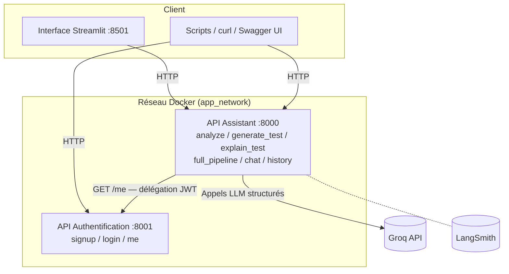

# 🧪 LangChain Unit Test Assistant

Assistant IA basé sur LangChain qui analyse du code Python, génère des tests
unitaires pytest, les explique, et propose un pipeline complet d'évaluation —
le tout exposé via deux API FastAPI sécurisées par JWT et une interface
Streamlit.

Projet réalisé dans le cadre de l'examen du module **LangChain & LLM
Experimentation** (certification MLOps / ML Engineering).

## Sommaire

- [Architecture](#architecture)
- [Fonctionnalités](#fonctionnalités)
- [Stack technique](#stack-technique)
- [Installation](#installation)
- [Lancement](#lancement)
- [Tests](#tests)
- [Interface Streamlit](#interface-streamlit)
- [Observabilité](#observabilité)
- [Structure du projet](#structure-du-projet)
- [Choix d'architecture](#choix-darchitecture)
- [Notes de développement](#notes-de-développement)
- [Limites connues](#limites-connues)
- [Pistes d'amélioration](#pistes-damélioration)

## Architecture

Deux services FastAPI indépendants, chacun conteneurisé séparément et
communiquant via un réseau Docker dédié :



**Principe clé** : l'API `main` ne décode jamais elle-même les JWT. Chaque
requête protégée déclenche un appel HTTP `GET /me` vers l'API `auth`, seule
détentrice de `JWT_SECRET`. Ce découplage permet de faire évoluer la logique
d'authentification (rotation de secret, révocation de tokens...) sans jamais
toucher au code de `main`.

## Fonctionnalités

| Endpoint | Méthode | Description |
|---|---|---|
| `/signup` | POST | Inscription d'un utilisateur (API auth) |
| `/login` | POST | Connexion, renvoie un JWT (API auth) |
| `/me` | GET | Identité déduite du JWT — appelée par `main`, pas seulement l'utilisateur (API auth) |
| `/analyze` | POST | Analyse un code Python (`is_optimal`, `issues`, `suggestions`) |
| `/generate_test` | POST | Génère un test unitaire pytest pour un code donné |
| `/explain_test` | POST | Explique en langage naturel un test unitaire donné |
| `/full_pipeline` | POST | Analyse → arrêt si non optimal, sinon génération + explication |
| `/chat` | POST | Conversation libre avec mémoire de contexte par utilisateur |
| `/history` | GET | Historique des échanges de l'utilisateur courant |

Toutes les routes de l'API assistant (sauf implicitement via FastAPI) exigent
un header `Authorization: Bearer <token>` valide.

## Stack technique

| Composant | Choix |
|---|---|
| Framework API | FastAPI 0.116 |
| Orchestration LLM | LangChain 1.2 / LangGraph 1.1 |
| Fournisseur LLM | Groq (`openai/gpt-oss-120b` par défaut, configurable) |
| Observabilité | LangSmith (endpoint EU) |
| Authentification | JWT (PyJWT) + bcrypt |
| Interface | Streamlit 1.47 |
| Gestion de paquets | uv (`pyproject.toml` / `uv.lock`) |
| Conteneurisation | Docker + docker-compose |
| Tests | pytest (unitaires + intégration conteneurs) |

## Installation

```bash
git clone https://github.com/ThGoncal/langchain-unit-test-assistant
cd langchain-unit-test-assistant
cp .env.example .env
```

Renseigne dans `.env` :
- `GROQ_API_KEY` — clé API Groq
- `CHAT_MODEL` — modèle Groq utilisé (ex. `groq:openai/gpt-oss-120b`)
- `JWT_SECRET` — secret de signature des tokens (obligatoire, aucune valeur par défaut)
- `LANGSMITH_API_KEY`, `LANGSMITH_PROJECT`, `LANGSMITH_ENDPOINT` — traçabilité (endpoint EU)

```bash
uv sync
```

## Lancement

### Avec Docker (recommandé pour une évaluation fidèle à la production)

```bash
make setup   # crée .env à partir du template si absent
make up      # build + démarre auth, main et streamlit
make logs    # suivre les logs de tous les services
make down    # arrêter
make clean   # arrêter + supprimer conteneurs, volumes et réseaux
```

`make up` construit et démarre désormais les 3 services (`auth`, `main`,
`streamlit`) — l'interface est accessible sur `http://localhost:8501`.

### En local sans Docker (développement)

```bash
uv run uvicorn api.authentification.auth:app --app-dir src --reload --port 8001
AUTH_URL=http://localhost:8001 uv run uvicorn api.assistant.main:app --app-dir src --reload --port 8000
```

## Tests

```bash
make tests                               # suite complète en conteneurs (9 tests)
uv run pytest tests/ -v                  # tests unitaires seuls, sans Docker
make -f Makefile.manual-tests tests      # tests manuels bout-en-bout (unitaires + API réelle + intégration réelle)
```

`Makefile.manual-tests` démarre les deux serveurs en local, rejoue des
scénarios réels (y compris les cas d'erreur : token absent, invalide, API
auth indisponible) contre de vraies réponses LLM, puis nettoie proprement —
complémentaire aux tests fournis, qui eux mockent les chaînes LangChain.

### Non-régression sur `/analyze`

`fixtures/code_samples/` contient des échantillons de code Python classés en
`optimal/` et `non_optimal/`, rejoués par `scripts/regression_check.py`
contre l'endpoint `/analyze` pour vérifier que le jugement du LLM reste
cohérent d'une session à l'autre (utile après un changement de prompt, de
modèle Groq, ou de température).

**Limite assumée** : `is_optimal` n'est pas parfaitement déterministe même à
température basse (voir [Limites connues](#limites-connues)) — ce mécanisme
est un canari, pas un test pass/fail strict. Un écart isolé n'indique pas
forcément une régression ; un écart systématique sur plusieurs exécutions,
plus probablement.

## Interface Streamlit

```bash
AUTH_URL=http://localhost:8001 API_URL=http://localhost:8000 uv run streamlit run src/app.py
```

Ouvre `http://localhost:8501` : inscription/connexion, puis 6 onglets
correspondant à chaque endpoint. Le test généré dans l'onglet "Générer un
test" est automatiquement repris dans "Expliquer un test".

## Observabilité

Chaque appel LLM est tracé sur LangSmith (projet défini par
`LANGSMITH_PROJECT`), avec un nom explicite par chaîne
(`analyse_code`, `generation_test`, `explication_test`, `agent_chat`) plutôt
que le nom générique par défaut — utile pour distinguer rapidement les runs
lors d'une revue.

## Structure du projet

```
## Structure du projet

```text
.
├── docker-compose.yml
├── Dockerfile.test
├── Makefile                        # orchestration Docker (setup/up/down/build/test/clean...)
├── Makefile.manual-tests           # tests manuels bout-en-bout, hors Docker
├── README.md
├── README_exam.md                  # énoncé original de l'examen, conservé pour référence
├── pyproject.toml / uv.lock
├── logs/                           # généré par Makefile.manual-tests (ignoré par git)
├── fixtures/
│   └── code_samples/               # échantillons de non-régression pour /analyze
│       ├── optimal/
│       └── non_optimal/
├── scripts/
│   ├── requests_auth.py            # test manuel de l'API auth isolée
│   ├── requests_main.py            # test manuel de l'API assistant isolée (mockée)
│   ├── requests_integration.py     # test manuel des 2 API réellement intégrées
│   └── regression_check.py         # rejoue fixtures/ contre /analyze, détecte les dérives   
├── src/
│   ├── app.py                      # interface Streamlit
│   ├── Dockerfile.streamlit
│   ├── requirements.txt            # dépendances partagées (core/prompts/memory)
│   ├── api/
│   │   ├── authentification/       # API auth (signup/login/me)
│   │   │   ├── Dockerfile.auth
│   │   │   ├── auth.py
│   │   │   └── requirements.txt
│   │   └── assistant/              # API principale (6 endpoints métier)
│   │       ├── Dockerfile.main
│   │       ├── main.py
│   │       └── requirements.txt
│   ├── core/                       # llm.py, schemas.py, chains.py
│   ├── prompts/                    # prompts CLEAR
│   └── memory/                     # historique par utilisateur
└── tests/
    ├── conftest.py
    ├── test_auth_api.py                # unitaire, TestClient
    ├── test_assistant_api.py           # unitaire, chaînes mockées
    └── test_container_integration.py   # intégration, vrais conteneurs
```

```

## Choix d'architecture

- **Factories plutôt qu'instances globales** (`get_analysis_chain()`,
  `get_llm()`...) : permet le remplacement des chaînes par des stubs en test
  unitaire (`monkeypatch.setattr`) sans jamais solliciter le LLM réel.
- **`method="json_mode"` plutôt que le mode outil par défaut** de
  `with_structured_output()` : Groq peut échouer avec `tool_choice is
  required` sur des tâches de génération en prose libre — le mode JSON est
  plus tolérant, au prix de devoir mentionner explicitement "JSON" dans
  chaque prompt système.
- **Prompts rédigés selon la méthode CLEAR** (Contexte, Longueur, Exemples,
  Audience, Rôle), avec exemples few-shot sur les 3 chaînes structurées —
  améliore la fiabilité du format de sortie au-delà du seul `json_mode`.
- **Température différenciée par chaîne** : 0.1 pour l'analyse et la
  génération de test (reproductibilité recherchée), 0.3 pour l'explication,
  0.7 pour le chat (naturel recherché).
- **Double mécanisme de mémoire** : le checkpointer LangGraph
  (`InMemorySaver`, indexé par `thread_id`) sert le modèle pour le contexte
  conversationnel ; `memory.py` sert l'API pour exposer `/history` — deux
  responsabilités distinctes, volontairement non fusionnées.

## Notes de développement

Quelques difficultés réelles rencontrées et résolues pendant le
développement, gardées ici à titre de documentation technique :

- **Dépréciation d'un modèle Groq en cours de projet** (`llama-3.3-70b-versatile`
  retiré du catalogue) — a confirmé l'intérêt de piloter le modèle via
  `CHAT_MODEL` plutôt qu'en dur dans le code.
- **`tool_choice is required, but model did not call a tool`** sur la chaîne
  d'explication — résolu par le passage à `method="json_mode"` (voir
  ci-dessus).
- **Exposition accidentelle du fichier `.env`** dans l'historique Git du
  premier dépôt — purgé via `git filter-repo`, puis dépôt recréé proprement
  avec un `.gitignore` posé dès le premier commit.
- **Couplage inattendu entre les deux conteneurs** : l'import direct
  `from api.authentification.auth import User` dans `main.py` (imposé par
  les tests fournis) implique que l'image `main` embarque aussi les
  dépendances (`bcrypt`, `pyjwt`) et la variable `JWT_SECRET` de l'API auth,
  alors qu'elle ne décode jamais elle-même de JWT.
- **Bug Streamlit "magic"** : une expression ternaire utilisée comme
  instruction (`st.success(...) if cond else st.warning(...)`) était
  interceptée par le magic de Streamlit et affichée via `st.help()` au lieu
  d'être simplement exécutée — corrigé en repassant par un `if`/`else`
  classique, plus adapté au contrôle d'effets de bord.
- **Variable `JWT_SECRET` manquante côté conteneur `tests`** — le service
  `tests` de `docker-compose.yml` ne recevait pas `env_file: .env`,
  contrairement à `auth`/`main`. Resté invisible tant qu'`auth.py` avait une
  valeur par défaut permissive pour `JWT_SECRET` ; révélé après le
  durcissement (`raise RuntimeError` si absent) — corrigé en ajoutant
  `env_file` au service `tests`.  

## Limites connues

- **Persistance en mémoire uniquement** (utilisateurs, historique) : tout
  redémarrage d'un conteneur efface les données — assumé pour un examen,
  inacceptable en production.
- **Jugement `is_optimal` non parfaitement déterministe** malgré une
  température basse — propriété du LLM sous-jacent, pas du code applicatif.
- **Un seul provider LLM supporté** (Groq) sans mécanisme de repli en cas de
  dépréciation de modèle.

## Pistes d'amélioration

Le périmètre ci-dessous dépasse volontairement les exigences de l'examen —
il documente comment ce projet évoluerait vers une application de
production.

### Fiabilité des données
- **PostgreSQL pour l'authentification** (remplacer `fake_users_db`) —
  survie aux redémarrages, contraintes d'unicité gérées par la base plutôt
  qu'en code, migrations versionnées (Alembic).
- **Historique conversationnel persistant** (Postgres ou Redis) au lieu du
  dict en mémoire de `memory.py` — nécessaire dès qu'on a plusieurs
  instances de `main` (voir load balancing ci-dessous), puisqu'un dict en
  mémoire process n'est pas partagé entre répliques.
- **Refresh tokens et révocation** — actuellement un JWT compromis reste
  valide jusqu'à expiration (10 min) sans moyen de le invalider plus tôt ;
  une liste de révocation (Redis) ou des refresh tokens à durée courte
  réduiraient cette fenêtre.

### Sécurité et scalabilité réseau
- **Nginx en reverse proxy** devant `auth` et `main` : terminaison TLS,
  masquage des ports internes, en-têtes de sécurité (HSTS, CSP), et
  limitation de débit (`limit_req`) pour se protéger contre les abus,
  particulièrement pertinent vu le coût des appels LLM par requête.
- **Équilibrage de charge** : plusieurs répliques de `main` derrière Nginx
  (`upstream` avec plusieurs conteneurs `main`), pertinent dès que
  l'historique/mémoire est externalisé (Postgres/Redis, cf. ci-dessus) —
  sans ça, chaque réplique aurait sa propre mémoire in-process désynchronisée.
- **Secrets via un gestionnaire dédié** (Vault, AWS Secrets Manager...)
  plutôt que `.env`/`env_file` — élimine le risque de fuite qu'on a
  rencontré concrètement pendant ce projet.

### Robustesse du modèle LLM
- **Validation et repli automatique du modèle configuré** (`CHAT_MODEL`) —
  déjà conçu et testé pendant ce projet (vérification via
  `Groq().models.list()`, repli sur un modèle de secours, avertissement
  explicite), volontairement non intégré pour rester dans le périmètre
  strict de l'examen.
- **Callbacks LangChain personnalisés** (`BaseCallbackHandler`) — au-delà du
  traçage LangSmith, un callback dédié permettrait de calculer des métriques
  métier propres (taux de code jugé optimal, temps de réponse par chaîne,
  coût cumulé par utilisateur) et de les exposer via un endpoint `/metrics`
  (Prometheus) plutôt que de dépendre uniquement d'un tableau de bord
  externe.
- **Fallback multi-provider** (ex. bascule Groq → OpenAI en cas
  d'indisponibilité prolongée) via le mécanisme `.with_fallbacks()` natif de
  LangChain.

### Qualité et exploitation
- **CI/CD** (GitHub Actions) exécutant `make tests` sur chaque pull request,
  avec rapport de couverture (`pytest-cov`) publié en commentaire de PR.
- **Logs structurés** (JSON, corrélés par `request_id`) plutôt que les logs
  uvicorn par défaut — facilite l'agrégation dans un système centralisé
  (ELK, Loki) une fois plusieurs répliques en jeu.
- **Rate limiting par utilisateur** au niveau applicatif (pas seulement
  Nginx) — pertinent vu le coût direct de chaque appel au LLM.

---

**Auteur** : Thierry ([@ThGoncal](https://github.com/ThGoncal))